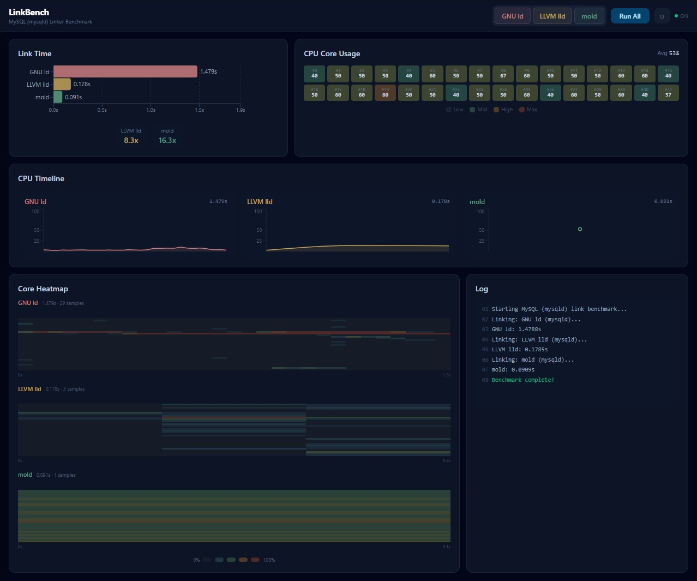

# LinkBench — Linker Performance Benchmark



GNU ld / LLVM lld / mold の 3 つのリンカで **MySQL (mysqld)** をリンクし、リンク速度と**論理プロセッサごとの CPU 使用率**を計測・可視化するウェブアプリケーションです。


## 機能

- **リンク時間比較**: 3 つのリンカのリンク時間を横棒グラフで比較（スピードアップ倍率付き）
- **個別 / 一括実行**: リンカごとの個別実行ボタンと「全て実行」ボタン
- **リアルタイム CPU モニター**: リンク中の各論理プロセッサの使用率をグリッド表示
- **CPU タイムライン**: リンカ別の CPU 使用率推移をエリアチャートで表示
- **ヒートマップ**: コア別 × 時間の CPU 使用率をヒートマップで可視化（mold の並列性が一目瞭然）
- **実行ログ**: ベンチマークの進行状況をリアルタイム表示

## アーキテクチャ

```
linkbench/
├── backend/                       # FastAPI バックエンド
│   ├── main.py                    # API サーバー + WebSocket
│   ├── benchmark.py               # MySQL リンクベンチマーク実行エンジン
│   ├── cpu_monitor.py             # CPU 使用率モニター (psutil)
│   └── requirements.txt
├── frontend/                      # React + Vite + TypeScript + Tailwind CSS
│   └── src/
│       ├── App.tsx                # メインダッシュボード
│       ├── useWebSocket.ts        # WebSocket 接続・状態管理
│       └── components/
│           ├── LinkTimeChart.tsx  # リンク時間比較チャート
│           ├── CpuGrid.tsx        # リアルタイム CPU グリッド
│           ├── CpuTimeline.tsx    # CPU 使用率タイムライン
│           ├── CpuHeatmap.tsx     # コア別ヒートマップ
│           └── StatusLog.tsx      # 実行ログ
├── scripts/
│   ├── install_linkers.sh         # リンカインストールスクリプト
│   ├── prepare_mysql.sh           # MySQL ソース取得・ビルドスクリプト
│   ├── start.sh                   # 本番起動スクリプト (ビルド + uvicorn)
│   ├── install_service.sh         # systemd サービス登録 / 解除
│   └── linkbench.service          # systemd ユニットファイル (テンプレート)
└── README.md
```

## セットアップ手順

### 1. 前提条件

- **Linux** (Ubuntu 22.04+ 推奨)
- **Python 3.10+**
- **Node.js 18+** & npm
- **G++** (cmake / ninja も必要)

### 2. リンカのインストール

```bash
chmod +x scripts/install_linkers.sh
./scripts/install_linkers.sh
```

手動の場合:

```bash
sudo apt-get install -y binutils lld mold
```

確認:

```bash
ld --version        # GNU ld
ld.lld --version    # LLVM lld
mold --version      # mold
```

### 3. MySQL オブジェクトファイルの準備

MySQL ソースをクローンし、オブジェクトファイルのコンパイルとリンクコマンドの抽出を行います（初回のみ、30 分程度かかります）。

```bash
chmod +x scripts/prepare_mysql.sh
./scripts/prepare_mysql.sh
```

完了すると `mysql_bench/` ディレクトリにビルド成果物と `link_command.txt` が生成されます。

### 4. バックエンドのセットアップ

```bash
python3 -m venv venv
source venv/bin/activate
pip install -r backend/requirements.txt
```

### 5. フロントエンドのセットアップ

```bash
cd frontend
npm install
cd ..
```

### 6. 起動

#### 開発モード (ホットリロード)

2 つのターミナルを使います。

**ターミナル 1 — バックエンド (FastAPI + ホットリロード):**

```bash
source venv/bin/activate
uvicorn backend.main:app --reload --port 8000
```

**ターミナル 2 — フロントエンド (Vite dev server):**

```bash
cd frontend
npm run dev
```

ブラウザで **http://localhost:5173** を開きます。
API・WebSocket は Vite のプロキシ経由でバックエンド (port 8000) に転送されます。

#### 本番モード (単一プロセス)

フロントエンドをビルドし、ポート 28000 で配信します。

```bash
./scripts/start.sh
```

ブラウザで **http://localhost:28000** を開きます。

環境変数でカスタマイズ可能:

| 変数 | デフォルト | 説明 |
|------|-----------|------|
| `LINKBENCH_HOST` | `0.0.0.0` | バインドアドレス |
| `LINKBENCH_PORT` | `28000` | ポート番号 |
| `LINKBENCH_WORKERS` | `1` | ワーカー数 |

### 7. systemd サービスとして常駐させる

```bash
# インストール & 起動
sudo ./scripts/install_service.sh install

# 状態確認
sudo systemctl status linkbench

# ログ確認 (リアルタイム)
sudo journalctl -u linkbench -f

# 再起動
sudo systemctl restart linkbench

# アンインストール
sudo ./scripts/install_service.sh uninstall
```

サービスはマシン起動時に自動的に開始されます。

## 使い方

1. ブラウザでダッシュボードを開く
2. ヘッダーのボタンで実行方法を選択:
   - **個別ボタン** (`GNU ld` / `LLVM lld` / `mold`): 選択したリンカのみ実行
   - **「Run All」**: 3 つのリンカを順番に実行
3. リンク中は以下がリアルタイム更新されます:
   - CPU グリッド: 各論理プロセッサの使用率
   - 実行ログ: 進行状況
4. 完了後、リンク時間チャート・CPU タイムライン・ヒートマップに結果が表示されます
5. **↺ リセットボタン** で結果をクリアできます

## ベンチマークの仕組み

### リンク対象

MySQL Server (mysqld) のオブジェクトファイルをリンク対象として使用します。`scripts/prepare_mysql.sh` が MySQL 8.0 のソースをクローン・ビルドし、ninja からリンクコマンドを抽出します。各リンカの実行時は `-fuse-ld=` フラグを差し替えてリンクを行います。

### CPU 使用率の計測

- `psutil` の `cpu_times()` を 50ms 間隔でサンプリングし、差分から使用率を算出
- WebSocket でリアルタイムにフロントエンドへ送信
- mold はマルチスレッドリンカのため、多くのコアが高使用率になるのが観察できます

## 比較対象リンカ

| リンカ | 開発元 | 特徴 |
|--------|--------|------|
| **GNU ld** (bfd) | GNU | 伝統的なリンカ。シングルスレッドで安定だが低速 |
| **LLVM lld** | LLVM Project | LLVM 製の高速リンカ。部分的にマルチスレッド |
| **mold** | Rui Ueyama | 超高速リンカ。高度な並列処理で桁違いの速度 |

## ライセンス

MIT License
